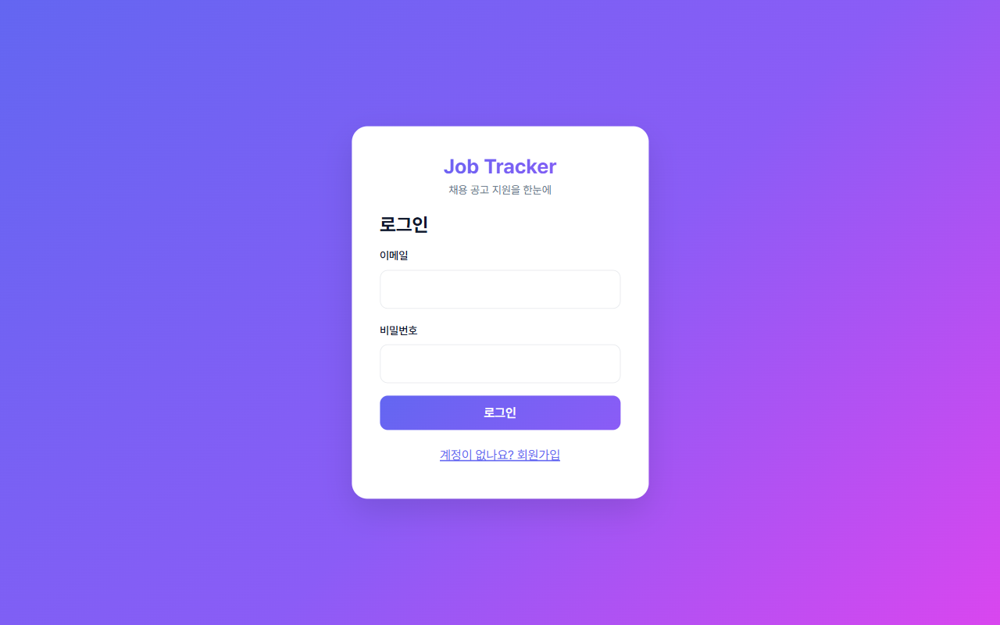
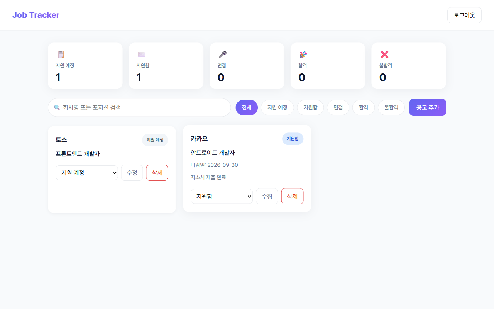
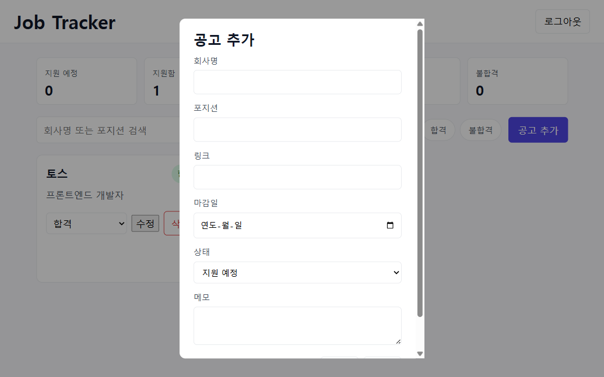
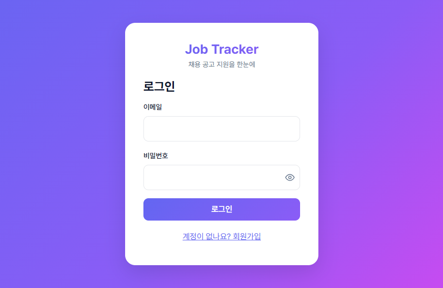
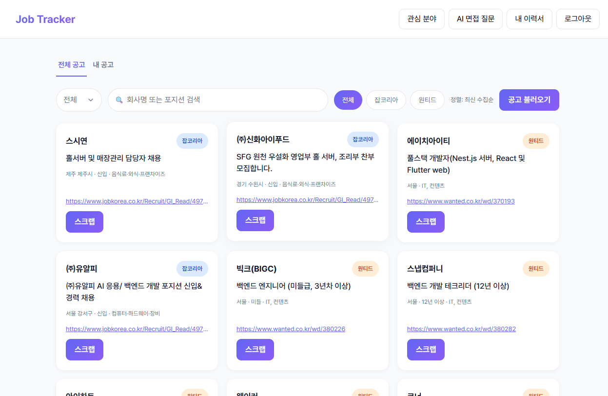
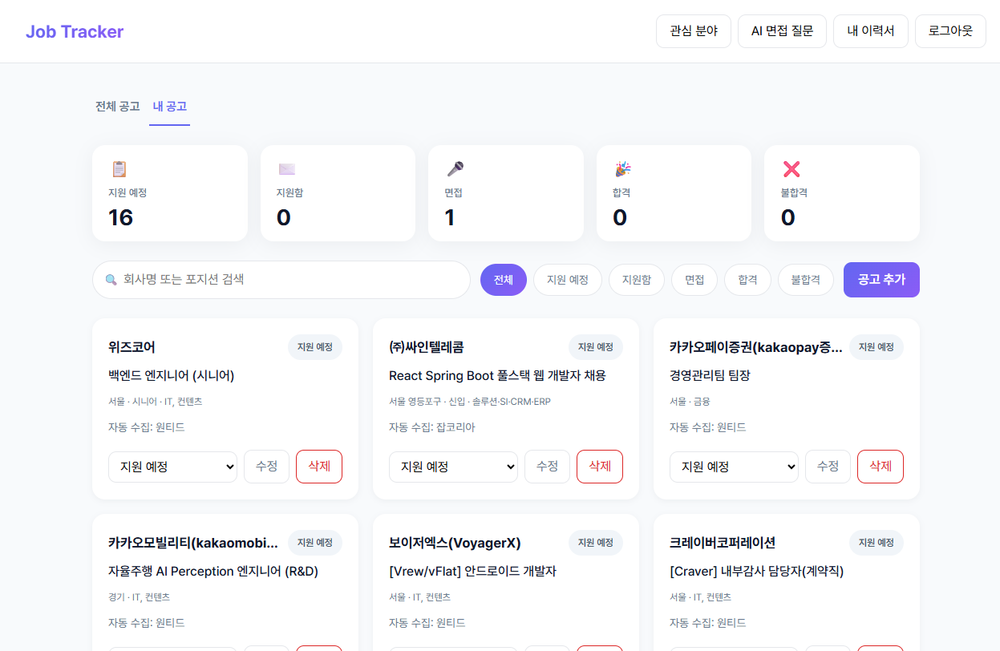
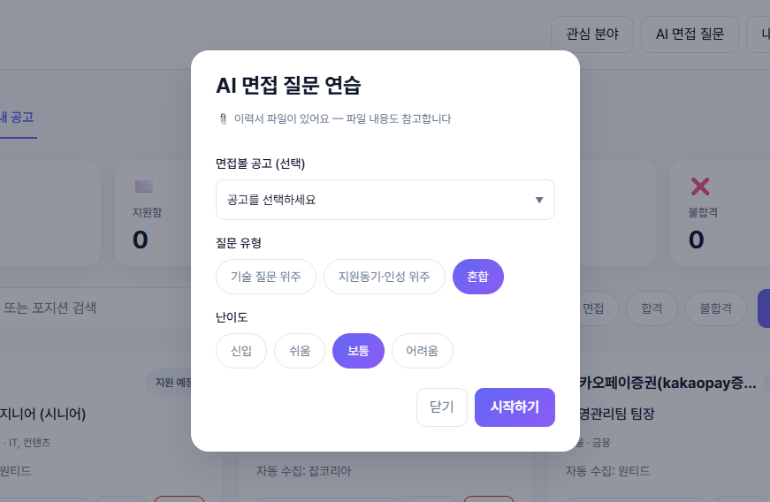
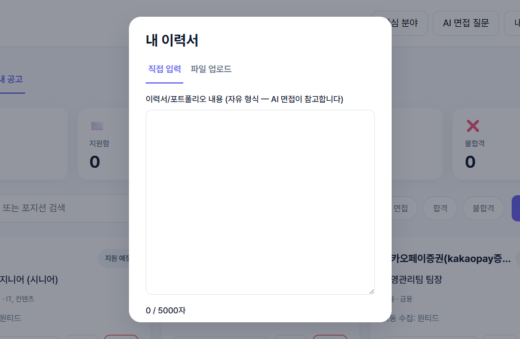

# Job Tracker — 채용 공고 지원 관리

취업 준비생이 **채용 공고를 스크랩하고 지원 현황을 한눈에 관리**하는 풀스택 웹 서비스입니다.

> **왜 만들었나요?** — 취업 준비하면서 실제로 필요해서 만들었습니다.
> 공고를 어디에 지원했는지, 지금 면접 단계인지, 어떤 회사가 합격했는지 기억하기 어려워서,
> 지원 상태를 직접 관리할 수 있는 서비스가 있으면 좋겠다고 생각했습니다.

## 화면







## 주요 기능

| 기능 | 설명 |
|---|---|
| 회원가입 / 로그인 | JWT 기반 인증 (Spring Security, BCrypt) |
| 채용공고 자동 수집 | 원티드·잡코리아 키워드 검색으로 즉시 수집 + **매일 17시 자동 수집** (GitHub Actions 크론) |
| 관심 분야 개인화 | 사용자별 키워드 저장 → 스크랩 공고는 내 공고로 이동으로 사람마다 다른 공고 제공 |
| 검색 필터 | 회사명 / 제목 / 전체 선택 검색 |
| 공고 스크랩 | 전체 공고에서 스크랩 → 내 공고로 (중복 방지, 새로고침 후에도 상태 유지) |
| 링크 자동 채우기 | 채용 링크 붙여넣기 시 회사·포지션 자동 추출 |
| 지원 상태 관리 | 지원 예정 → 지원함 → 면접 → 합격 / 불합격 (상태 변경) |
| 통계 대시보드 | 상태별 지원 현황 한눈에 보기 |
| 공고 정보 확장 | 지역 / 경력 / 업종 입력·표시 |
| 전체 공고 검색·마감일 | 프론트 즉시 필터 검색 + 마감일 표시 + 더보기 페이지네이션 |
| 이력서 관리 | 텍스트 입력 + PDF/PPT/PPTX 업로드(최대 3개), 목록 조회·개별 삭제 |
| AI 예상 면접 질문 | 질문 유형(기술 / 지원동기·인성 / 혼합), 난이도(신입~어려움) 선택, 공고 선택(선택 사항), 이력서 최대 3개 다중 참고(usedResume으로 반영 여부 표시), 공고 URL 입력 시 실시간 크롤링으로 자격요건·주요업무 반영 |

## 화면 소개

| | |
|---|---|
|  |  |
|  |  |
|  | |

## 기술 스택

```
백엔드:  Spring Boot 4.1 · Spring Security + JWT · Spring Data JPA · PostgreSQL
프론트:  React 19 · Vite · TypeScript · React Router
테스트:  JUnit + MockMvc · JaCoCo (백엔드 128개, 라인 81% / 브랜치 68%)
         Vitest + Testing Library (프론트 72개, 라인 81.52% / 함수 66%)
         Playwright (실화면 자동 검증)
인프라:  Docker (multi-stage) · GitHub Actions CI · Render (클라우드 배포)
```

## 배포

**Render 무료 티어로 배포 중** — https://job-tracker-so4v.onrender.com

데모 계정: `final@test.com` / `password123` (스크랩·지원 상태가 채워진 시연용 계정)

```
배포 구성:
  - 프론트+백엔드 단일 Docker 이미지 (React 빌드 → Spring static 서빙)
  - Render PostgreSQL (환경변수로 DB 설정 주입)
  - 헬스체크: /api/health (배포 성공 판정용)
  - 매일 17시 GitHub Actions 크론이 채용공고 자동 수집
    (무료 티어 스핀다운 때문에 서버 내부 스케줄러 대신 외부 크론 사용)
  - 크롤링 트랜잭션 분리 + HikariCP 커넥션풀 설정 보강으로 크롤링 중 500 에러 방지
```

## 프로젝트 구조

```
job-tracker/
├── src/main/java/com/example/jobtracker/
│   ├── controller/        # API 엔드포인트 (auth, job, health)
│   ├── service/           # 비즈니스 로직
│   ├── repository/        # DB 접근
│   ├── entity/            # JPA 엔티티 (users, job_postings, collected_jobs)
│   ├── dto/               # 요청/응답 객체 (Entity 직접 노출 방지)
│   ├── security/          # JWT 필터, SecurityConfig
│   └── exception/         # 전역 예외 처리
├── frontend/
│   ├── src/pages/         # LoginPage, JobListPage
│   ├── src/components/    # Header, StatusBadge, JobFormModal, KeywordsModal
│   └── src/api.ts         # fetch 래퍼 (토큰 관리)
└── .github/workflows/     # CI + daily-collect (매일 공고 자동 수집)
```

## 실행 방법

### 백엔드 (Spring Boot, 8080)

```bash
# 1. PostgreSQL에 DB 생성
createdb job_tracker

# 2. 환경변수 설정 (JWT 시크릿 — 32바이트 이상, DB 접속 정보)
# Windows: setx JWT_SECRET "여기에-긴-랜덤-문자열"
# Windows: setx DB_PASSWORD "postgres"

# 3. 실행
mvn spring-boot:run
```

### 프론트 (Vite, 5173)

```bash
cd frontend
npm install
npm run dev
```

접속: http://localhost:5173 (dev 서버가 /api를 백엔드 8080으로 프록시)

## 테스트

```bash
# 백엔드: 테스트 + 커버리지 리포트 (target/site/jacoco)
mvn test

# 프론트: 테스트 + 커버리지 리포트 (frontend/coverage)
cd frontend
npm test
npm run coverage
```

| 영역 | 테스트 수 | 커버리지 |
|---|---|---|
| 백엔드 (Java) | 128개 | 라인 81% / 브랜치 68% (외부 크롤링 호출부는 의도적 제외) |
| 프론트 (TS) | 72개 | 라인 81.52% / 함수 66% |

## CI/CD

- **GitHub Actions CI** (push마다 자동): 시크릿 스캔(gitleaks) / 백엔드 테스트 / 프론트 테스트·빌드 / Docker 빌드
- **daily-collect** (매일 17시): Render 웜업 → 로그인 → 사용자 키워드 합집합 조회 → 키워드별 공고 수집

## 주요 API

| Method | URL | 설명 |
|---|---|---|
| POST | /api/auth/signup | 회원가입 |
| POST | /api/auth/login | 로그인 (JWT 발급) |
| GET | /api/auth/me | 내 정보 |
| PUT | /api/auth/me/keywords | 관심 분야 설정 |
| GET | /api/health | 헬스체크 (배포용) |
| GET | /api/jobs | 내 공고 목록 (?status=&keyword=) |
| POST | /api/jobs | 공고 저장 |
| PATCH | /api/jobs/{id} | 공고 수정 (상태 변경 포함) |
| DELETE | /api/jobs/{id} | 공고 삭제 |
| GET | /api/jobs/stats | 상태별 통계 |
| POST | /api/jobs/collect/search | 키워드 즉시 검색·수집 (원티드/잡코리아) |
| GET | /api/jobs/collect/keywords | 전체 사용자 키워드 합집합 (크론용) |
| GET | /api/jobs/collected | 수집 공고 목록 (?source=&keyword=&mine=&searchField=) |
| POST | /api/jobs/collected/{id}/scrap | 공고 스크랩 → 내 공고로 |
| POST | /api/jobs/collected/crawl | 관심 키워드 크롤링 + 기존 공고 마감일 갱신 |
| GET | /api/auth/me/profile/files | 이력서 파일 목록 (최대 3개) |
| PUT | /api/auth/me/profile/file | 이력서 파일 업로드 (PDF/PPT/PPTX) |
| GET | /api/auth/me/profile/file/{fileId}/download | 이력서 파일 다운로드 |
| DELETE | /api/auth/me/profile/file/{fileId} | 이력서 파일 삭제 |
| POST | /api/ai/interview/questions | AI 예상 면접 질문 생성 (유형/난이도/공고/이력서 반영) |

## 보안

- 비밀번호는 **BCrypt로 암호화**하여 저장 (평문 저장 금지)
- 모든 API는 **JWT 토큰 필수** (회원가입/로그인/헬스체크/키워드 조회 제외)
- **내 공고만** 조회/수정/삭제 가능 — 남의 공고 접근 시 404 (존재 여부도 숨김)
- 링크 프리뷰는 **SSRF 방어** (localhost 등 내부 주소 차단)
- 설정 파일(application.yml)은 git에 커밋하지 않음 — `application.example.yml` 양식 제공
- CI에서 **gitleaks 시크릿 스캔**으로 키 노출 자동 감지
